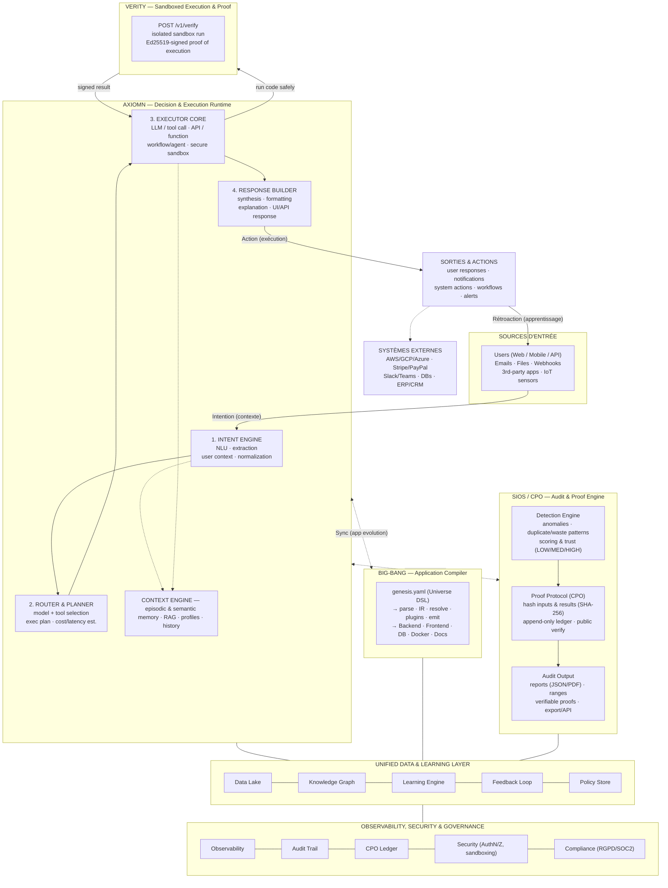

# AXIOMN Unified System Architecture

> **AXIOMN** (Decision Runtime) · **BIG-BANG** (Application Compiler) · **SIOS / CPO** (Audit & Proof Engine) · **VERITY** (Sandboxed Execution & Proof)
>
> One closed loop: **Intention → Décision → Exécution → Mesure → Apprentissage → Évolution.**

This document is the shared, version-controlled source of truth for how the four
repositories fit together. It lives identically in each repo
([`AXIOMN`](https://github.com/haynbroit-alt/axiomn),
[`BIG-BANG`](https://github.com/haynbroit-alt/big-bang),
[`CPO`](https://github.com/haynbroit-alt/cpo),
[`V-rify-IA`](https://github.com/haynbroit-alt/v-rify-ia)) so that whichever one
you land on, the whole picture is one click away. The diagram below is **Mermaid**
— edit it in a text diff, not an image editor.

---

## The closed intelligent loop

| # | Stage | Owner | What happens |
|---|-------|-------|--------------|
| 1 | **Intention** | AXIOMN | A user (or system) expresses an intent. AXIOMN classifies it. |
| 2 | **Décision** | AXIOMN | The Router picks the cheapest capable route/model — and says *why*. |
| 3 | **Exécution** | AXIOMN · VERITY · BIG-BANG | The Executor calls an LLM/tool; code runs in VERITY's sandbox; BIG-BANG builds/updates apps when infrastructure is needed. |
| 4 | **Mesure** | SIOS / CPO · AXIOMN | SIOS detects, scores, and **proves** outcomes; AXIOMN's metrics measure routing savings. |
| 5 | **Apprentissage** | AXIOMN | Success/failure feeds back into the Router's trust scores and future plans. |
| 6 | **Évolution** | all | The loop restarts, more intelligent than the last pass. |

---

## Architecture diagram (editable)

---

## Component → repository map

The diagram's boxes correspond to real code as follows.

### AXIOMN — Decision & Execution Runtime · `axiomn/`
The LLM decision runtime. A request enters at `POST /v1/intent` and runs the
full **Intent → Route → Execute → Act** pipeline.

| Diagram box | Code |
|---|---|
| Intent Engine | `axiomn/intent/` (`IntentEngine`, classifiers, optional LLM fallback) |
| Router & Planner | `axiomn/router/router.py` (`Router`, trust-scored routes) |
| Executor Core | `axiomn/execution/engine.py` + `axiomn/models/tools.py` (tool registry) |
| Executor Core → "secure sandbox" | **`axiomn/sandbox/` → VERITY** (see integration below) |
| Response / Action | `axiomn/action/engine.py` |
| Gateway (model selection) | `axiomn/gateway/` (multi-provider, cost/quality routing) |
| Measure | `axiomn/metrics/` (`GET /v1/metrics` — savings vs no-routing baseline) |
| Human route | `axiomn/queue/` (`/v1/queue/...` — escalate to a human) |

### BIG-BANG — Application Compiler · `bigbang/`
"Universe as Code." A single `genesis.yaml` (entities, roles, flows,
monetization) compiles to a complete application — and is re-compiled on change
without clobbering hand edits.

| Diagram box | Code |
|---|---|
| Universe DSL | `genesis.yaml`, `bigbang/parser.py`, `bigbang/universe.py` |
| Compiler pipeline | `bigbang/pipeline.py` → `ir_builder.py` → `resolver.py` → emitters |
| Emitters / Generated app | `bigbang/emitters/{fastapi,frontend,docker,docs}.py` |
| Plugins (auth, db, …) | `bigbang/plugins/` (incl. `ed25519.py` — proof-signing) |

### SIOS / CPO — Audit & Proof Engine · `sios/`
Detects financial-loss patterns in transaction data; every finding is
probabilistically scored **and** cryptographically signed. **CPO** is the proof
protocol (content hashing + append-only ledger); **SIOS** is the product.

| Diagram box | Code |
|---|---|
| Detection Engine | `sios/value_engine/` (detectors) + `sios/discovery/` |
| Scoring & Trust | `sios/value_engine/trust.py` (LOW/MED/HIGH confidence) |
| Proof Protocol (CPO / SHA-256) | `sios/proof_layer/` (`trail.py`, hashes, append-only) |
| Audit Output | `sios/pipeline.py` (`AuditResult`), `sios/cashflow/pdf.py`, `sios/api/routes.py` |
| One-line API | `from sios import SIOS; SIOS().run("transactions.csv")` |

### VERITY — Sandboxed Execution & Proof · `verity/`, `app/`
Runs AI-generated (untrusted) code in an isolated sandbox and returns an
Ed25519-signed proof of exactly what executed. This *is* the Executor Core's
"secure sandbox" box.

| Diagram box | Code |
|---|---|
| Sandbox entry point | `POST /v1/verify` (`app/main.py`, `app/orchestrator.py`) |
| Proof / ledger | `app/ledger.py` (Ed25519), `GET /v1/proof/{action_id}`, `/v1/public-key` |
| Python client | `verity/client.py` (`VerityClient.run(...)`) |

---

## Integration points (what actually connects, in code)

### 1. AXIOMN Executor → VERITY sandbox ✅ implemented
When the Router sends a code-execution (`AUTOMATE`) intent to the Executor Core,
AXIOMN can run that code in VERITY instead of in-process, and keep the signed
proof.

- **Where:** `axiomn/sandbox/verity.py` (`VeritySandboxHandler`), registered by
  `axiomn/models/tools.py::default_registry` and bootstrapped in
  `axiomn/api/main.py`.
- **How to enable:** set `AXIOMN_VERITY_URL=https://<verity-host>` (optionally
  `AXIOMN_VERITY_LANGUAGE`). The handler POSTs the intent to VERITY's
  `/v1/verify`, then surfaces `stdout` as the tool output and the full proof
  (`action_id`, `signature`, `verified`, `security_flags`) in
  `ToolResult.metadata["verity"]`.
- **Opt-in & fail-open:** with no `AXIOMN_VERITY_URL`, the sandbox tool is not
  registered and behavior is identical to before. If a configured VERITY is
  unreachable, the handler returns `success=False` (so the Router learns the
  route is degraded) instead of raising — the runtime never goes down with the
  sandbox. Covered by `tests/test_sandbox.py`.

### 2. Shared proof discipline (CPO ↔ VERITY ↔ BIG-BANG)
All three sign artifacts with the same primitives — SHA-256 content hashing plus
Ed25519 signatures over an append-only record (`sios/proof_layer/`,
`app/ledger.py`, `bigbang/plugins/ed25519.py`). This is the common "CPO Ledger"
foundation in the diagram: a proof produced by one system is verifiable by
anyone holding the public key, no access to the producer required.

### 3. AXIOMN ↔ BIG-BANG and AXIOMN ↔ SIOS — *design intent, not yet wired*
The diagram's "Sync (app evolution)" and "measure / prove" arrows are
**aspirational**: AXIOMN deciding an intent needs new infrastructure and asking
BIG-BANG to compile it, or handing outputs to SIOS for audit. There is no code
path between these repos today. See the reality check.

---

## Reality check — diagram vs. code today

The diagram is a **target architecture**. Honest status of each piece:

| Element in the diagram | Status in code |
|---|---|
| AXIOMN Intent → Route → Execute → Act pipeline | ✅ Real (`POST /v1/intent`) |
| Router with trust scores + metrics/savings | ✅ Real (`axiomn/router`, `/v1/metrics`) |
| Executor "secure sandbox" → VERITY | ✅ Real (this change: `axiomn/sandbox/`) |
| VERITY sandbox + Ed25519 proof | ✅ Real (`app/`, deployed at `v-rify-ia.fly.dev`) |
| SIOS detection + CPO proof layer | ✅ Real (`sios/value_engine`, `sios/proof_layer`) |
| BIG-BANG genesis.yaml → full app compile | ✅ Real (`bigbang/pipeline.py`, CLI `big-bang bang`) |
| "Context Engine" (episodic/semantic memory, RAG) | ⚠️ Partial — routing/context exists; no unified memory service |
| "Unified Data & Learning Layer" (data lake, knowledge graph, feedback) | ❌ Conceptual — no shared data/learning service across repos |
| AXIOMN ↔ BIG-BANG "Sync" | ❌ Not wired — no cross-repo call |
| AXIOMN ↔ SIOS "measure/prove" | ❌ Not wired — no cross-repo call |
| Observability / Compliance foundation (RGPD, SOC2) | ⚠️ Partial — per-repo logging + audit trails; no unified governance plane |

**Bottom line.** Each of the four systems is real and works on its own. The
first genuine cross-system seam — AXIOMN's Executor running code in VERITY's
proof sandbox — is implemented here. The remaining arrows (shared data/learning
layer, AXIOMN↔BIG-BANG, AXIOMN↔SIOS) are the roadmap, not yet code, and are
labeled as such above so no one mistakes the map for the territory.
